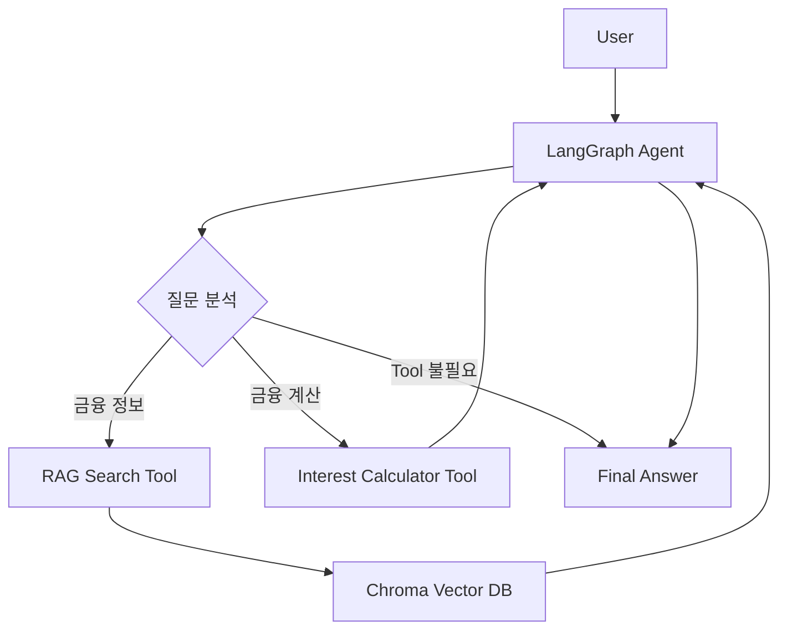

# FinAgent

금융 질문에 따라 관련 문서를 검색하거나 이자 계산 기능을 호출해 답변하는 AI Agent 프로젝트입니다.
OpenAI API를 기반으로 RAG, LangGraph, MCP를 순차적으로 적용하며 Agent 구조를 구현했습니다.

---
## 주요 기능

### 금융 정보 검색

예금, 적금, 대출 등 금융상품 관련 질문은  
금융 문서를 Vector DB에서 검색한 뒤 검색된 Context를 기반으로 답변합니다.

```text
금융 문서
  ↓
Chunking
  ↓
Embedding
  ↓
Chroma Vector DB
  ↓
Similarity Search
  ↓
LLM 답변
```

### 금융 계산 Tool

원금, 금리, 기간이 포함된 질문은 Agent가 계산 Tool을 선택합니다.

```text
질문:
5000만원을 연 3%로 1년 예금하면 이자가 얼마야?

Tool:
calculate_interest

답변:
예상 이자 150만원
만기 총액 5150만원
```

### LangGraph Agent

질문 유형에 따라 적절한 Tool을 선택하고  
Tool 실행 결과를 다시 LLM에 전달해 최종 답변을 생성합니다.



### MCP Tool

기존 이자 계산 기능을 MCP Server의 Tool로 제공하고  
MCP Inspector를 이용해 실제 호출을 검증했습니다.

```text
MCP Client
   ↓
MCP Server
   ↓
calculate_deposit_interest
   ↓
Interest Calculator
```

---

## 기술 스택

- Python 3.11
- OpenAI API
- LangChain
- LangGraph
- ChromaDB
- OpenAI Embeddings
- Model Context Protocol (MCP)

---

## 프로젝트 구조

```text
FinAgent
├── app
│   ├── main.py
│   ├── agent.py
│   ├── tools.py
│   ├── rag.py
│   └── mcp_server.py
│
├── data
│   └── finance.txt
│
├── requirements.txt
└── README.md
```

| 파일 | 역할 |
|---|---|
| `main.py` | OpenAI Function Calling |
| `agent.py` | LangGraph Agent Workflow |
| `tools.py` | 금융 계산 Tool |
| `rag.py` | Chunking, Embedding, Vector DB 검색 |
| `mcp_server.py` | MCP Server |

---

## 실행

```bash
python3.11 -m venv venv
source venv/bin/activate
pip install -r requirements.txt
```

`.env`

```env
OPENAI_API_KEY=YOUR_OPENAI_API_KEY
```

Agent 실행:

```bash
python app/agent.py
```

MCP 테스트:

```bash
mcp dev app/mcp_server.py
```

